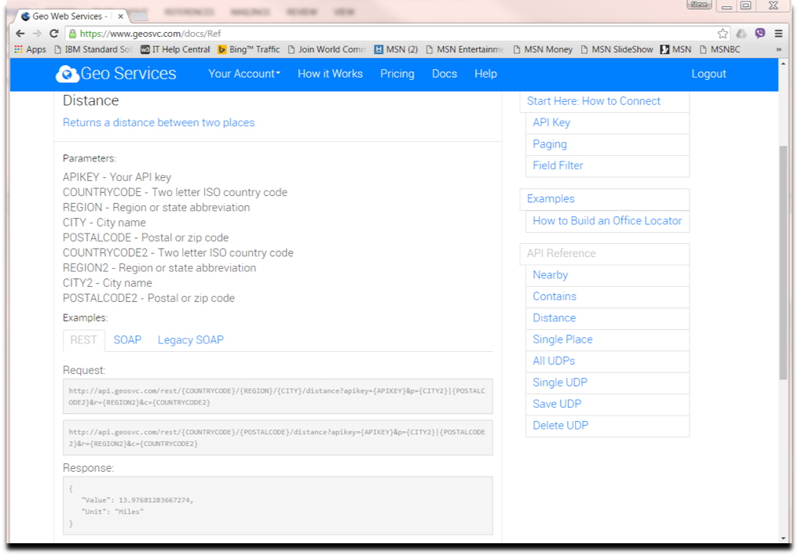
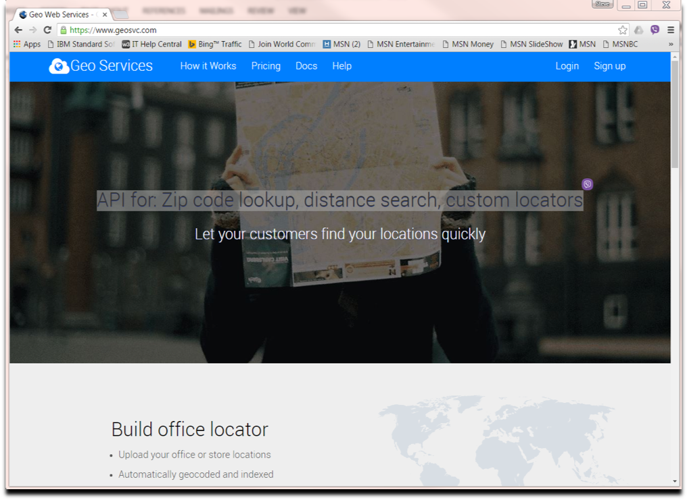

## Example-GeoServices
Geo Services is a published REST API that allows applications to find distances between two points on the map, and to get geographical information about a municipality and its zip codes, area codes, and latitude/longitude coordinates.

This sample uses the HTTP/HTTPS enabler portion of the toolkit to issue the Geo Services Distance REST API to obtain distance between two cities and the JSON Parser portion to retrieve the information from the response body.

[Distance REST API Reference](http://geosvc.com/docs/Ref)



The take away from the above are the following pieces:
 - **Uniform Resource Identifier (URI)**
 ```
 http://api.geosvc.com/rest/{COUNTRYCODE}/{REGION}/{CITY}/distance?apikey={APIKEY}&p={CITY2}&r={REGION2}&c={COUNTRYCODE2}
 ```
   - **Connection portion of URI** (Where and how to connect?):
   ```
   http://api.geosvc.com
   ```
   This is the value the program provides for the `HWTH_HANDLETYPE_HTTPREQUEST`	option associated with the `ConnectionHandle`.

   - **Request portion of the URI** (What is the particular request, including query parameters?):
   ```
   /rest/{COUNTRYCODE}/{REGION}/{CITY}/distance?apikey={APIKEY}&p={CITY2}&r={REGION2}&c={COUNTRYCODE2}
   ```
   This is the value the program provides for the `HWTH_HANDLETYPE_HTTPREQUEST`	option associated with the `RequestHandle`.
 - **HTTP Method**: GET

 This method corresponds to the `HWTH_HTTP_REQUEST_GET` value that is specified for the `HWTH_OPT_REQUESTMETHOD` option associated with the 'RequestHandle'.

 - **Response format**: JSON

 The exec specifies an `Accept:application/json` header using the `HWTH_OPT_HTTPHEADERS` option to request the server returns the response body in JSON.


## Prep work

To run the sample, you first need to obtain a *Public Key* to use for the Geo Services REST API requests. This key is how the Geo Services server regulates the daily usage allowance per user.

Launch a web browser to the [Geo Services URI](http://geosvc.com) and follow the **Sign up** link in the upper right hand corner.



Fill in an email address (hint: it's not verified) and a password and click **Get Started**.


Save the Public Key that is generated based on your sign up.


In addition, you also need to update the value of the `traceDataSetName` variable in the **RXEXEC1** exec itself.
```
traceDataSetName = 'REPLACE.ME'
```
This variable points to a pre-allocated sequential z/OS data set which will contain any trace debugging messages generated by the toolkit. The exec allocates a `MYTRACE` DD statement to point to the sequential data set and sets  [`HWTH_OPT_VERBOSE_OUTPUT`](https://www.ibm.com/support/knowledgecenter/en/SSLTBW_2.3.0/com.ibm.zos.v2r3.ieac100/ieac1-cwe-http-options.htm) option to the `MYTRACE` DD name.

The sequential data set must adhere to the following recommended attributes:
 * Physical sequential (DSORG=PS)
 * Unblocked variable or undefined record format (RECFM=V or RECFM=U)
 * Unspecified (or zero-valued) block size and record length, so that the default values will be set when the DD is opened
 * Expandable (nonzero primary and secondary extents)
 * Disposition of OLD (DISP=OLD), or NEW (DISP=NEW) if allocated in a DD statement in the same JCL job step that includes the EXEC for your toolkit application

## Invocation
**Syntax**:  
```
 RXEXEC1 PublicKey City1, State1,Country1 City2,State2,Country2 -v
 ```
 where:
  - *city* is the name of the city
  - *state* is the 2-letter state abbreviation
  - *country* is the 2-letter country abbreviation
  - *publickey* is the Public Key you saved when you signed up for Geo Services
  - *–v* is an optional parameter that will turn on verbose output, the output is directed to the data set specified by **traceDataSetName** variable inside exec

**sample invocation in TSO:**
 ```
 ex 'SCOUT.HWT.LAB(RXEXEC1)' '4e39f8f8910442769bb2c17293475a10 Denver,CO,US Providence,RI,US'
 ex 'SCOUT.HWT.LAB(RXEXEC1)' '4e39f8f8910442769bb2c17293475a10 Denver,CO,US Providence,RI,US -v'
 ```

**sample invocation in UNIX:**
```
./rxexec1 4e39f8f8910442769bb2c17293475a10 Denver,CO,US Providence,RI,US
./rxexec1 4e39f8f8910442769bb2c17293475a10 Denver,CO,US Providence,RI,US -v
```

**sample output with verbose flag not specified:**
```                                                                               
HTTP Web Enablement Toolkit Sample (Begin)

The distance between denver, co, us and
 providence, ri, us is 1757
 Miles.

HTTP Web Enablement Toolkit Sample (End)                                                                                            
```
