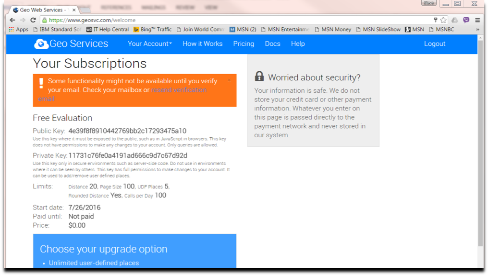

# **Example-GeoServices**

This project demonstrates how to use the z/OS client web enablement toolkit to obtain the distance between two cities using the Geo Services REST API.

Geo Services is a published REST API that allows applications to find distances between two points on the map, and to get geographical information about a municipality and its zip codes, area codes, and latitude/longitude coordinates.

## Distance REST API format
For this example, we will be using the **Distance** REST API defined by the  [http://geosvc.com/docs/Ref](http://geosvc.com/docs/Ref).


The example requires knowledge of the following pieces which you can gather from the reference:
 - **Uniform Resource Identifier (URI)**
 ```
 http://api.geosvc.com/rest/{COUNTRYCODE}/{REGION}/{CITY}/distance?apikey={APIKEY}&p={CITY2}&r={REGION2}&c={COUNTRYCODE2}
 ```
 ```
 scheme://host[:port] [/]path[?query][#fragment]
|-------------------||-------------------------|
	where and how to      what is the particular
    connect?              request?
 ```
   - **Connection portion of URI**: http://api.geosvc.com
   - **Request portion of the URI**: /rest/{COUNTRYCODE}/{REGION}/{CITY}/distance?apikey={APIKEY}&p={CITY2}&r={REGION2}&c={COUNTRYCODE2}
 - **HTTP Method**: GET
 - **Parameters**
  ```
APIKEY - Your API key
COUNTRYCODE - Two letter ISO country code
REGION - Region or state abbreviation
CITY - City name
CITY2 - City name
COUNTRYCODE2 - Two letter ISO country code
REGION2 - Region or state abbreviation
CITY2 - City name
 ```
 - **Response format**: JSON

 ## **Pre-requisites**
 System stuff???

 ## Retrieve public key
 The first thing you need to do is retrieve a *Public Key* to use for the Geo Services. This key is how the Geo Services server regulates the daily usage allowance per user.

 - Launch a web browser to the following URI [http://geosvc.com](http://geosvc.com)

 

 - Click **Sign up** in the upper right hand corner.

 - Enter an email address and a password and click **Get Started**.
   - *Note: the email address is not verified.*

 

 - Save the Public Key that is generated based on your sign up. You will use this when issuing Geo Services REST API requests.  There is a limit of 20 requests per day.  Hopefully, you won't need that many to get it working.

 

 ## **Running the sample**
 This REXX sample can be be invoked from the TSO command line.

 **Syntax**:  
```
 ex '<dataset name>(RXEXEC1)' 'publickey City1, State1,Country1 City2,State2,Country2 -v'
 ```
 where:
 - *city* is the name of the city
 - *state* is the 2-letter state abbreviation
 - *country* is the 2-letter country abbreviation
 - *publickey* is the Public Key you saved when you signed up  
 - *–v* is to turn on verbose output, the output is directed to a sequential variable data set `<userid>.ZOSREST.TRACE`

 **Example invocation**:
 ```
 ex 'SCOUT.ZOSREST.LAB(RXEXEC1)' '4e39f8f8910442769bb2c17293475a10 Denver,CO,US Providence,RI,US -v'
 ``
