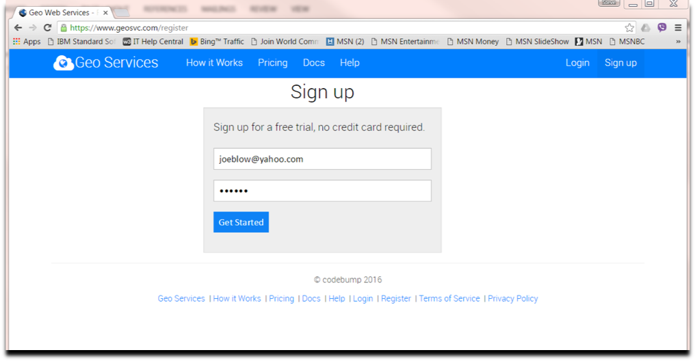

## Example-GeoServices
Geo Services is a published REST API that allows applications to find distances between two points on the map, and to get geographical information about a municipality and its zip codes, area codes, and latitude/longitude coordinates.

This sample uses the HTTP/HTTPS enabler portion of the toolkit to issue the Geo Services Distance REST API to obtain distance between two cities and the JSON Parser portion to retrieve the information from the response body.

[Distance REST API Reference](http://geosvc.com/docs/Ref)


 - **Uniform Resource Identifier (URI)**
 ```
 http://api.geosvc.com/rest/{COUNTRYCODE}/{REGION}/{CITY}/distance?apikey={APIKEY}&p={CITY2}&r={REGION2}&c={COUNTRYCODE2}
 ```
   - **Connection portion of URI** (Where and how to connect?):
   ```
   http://api.geosvc.com
   ```
   - **Request portion of the URI** (What is the particular request?):
   ```
   /rest/{COUNTRYCODE}/{REGION}/{CITY}/distance?apikey={APIKEY}&p={CITY2}&r={REGION2}&c={COUNTRYCODE2}
   ```
 - **HTTP Method**: GET
 - **Parameters**
  ```
APIKEY - Your API key
COUNTRYCODE - Two letter ISO country code
REGION - Region or state abbreviation
CITY - City name
CITY2 - City name
COUNTRYCODE2 - Two letter ISO country code
REGION2 - Region or state abbreviation
CITY2 - City name
 ```
 - **Response format**: JSON

To run the sample, you first need to obtain a *Public Key* to use for the Geo Services REST API requests. This key is how the Geo Services server regulates the daily usage allowance per user.

Launch a web browser to the [Geo Services URI](http://geosvc.com) and follow the **Sign up** link in the upper right hand corner.


Fill in an email address (hint: it's not verified) and a password and click **Get Started**.


Save the Public Key that is generated based on your sign up. There is a limit of 20 requests per day.  Hopefully, you won't need that many to get it working.


In addition you also need to update the trace data set reference in the exec. Toolkit requires the verbose output directory to exist GG: add link to the pubs:

Locate the two lines below and fill in the corresponding information:
```
traceDataSetName = 'REPLACE.WITH.PREALLOCATED.DATASET'
traceDD = 'MYTRACE'
```

The REXX sample can be be invoked from the TSO command line.

**Syntax**:  
```
 ex '<dataset name>(RXEXEC1)' 'publickey City1, State1,Country1 City2,State2,Country2 -v'
 ```
 where:
  - *city* is the name of the city
  - *state* is the 2-letter state abbreviation
  - *country* is the 2-letter country abbreviation
  - *publickey* is the Public Key you saved when you signed up for Geo Services
  - *–v* is to turn on verbose output, the output is directed to a sequential variable data set `<userid>.ZOSREST.TRACE`


 **Example invocation**:
from TSO
 ```
 ex 'SCOUT.ZOSREST.LAB(RXEXEC1)' '4e39f8f8910442769bb2c17293475a10 Denver,CO,US Providence,RI,US -v'
 ```

from UNIX
```
rxexec1 4e39f8f8910442769bb2c17293475a10 Denver,CO,US Providence,RI,US
```
You will receive an output similar to the one below
```                                                                               
HTTP Web Enablement Toolkit Sample (Begin)

The distance between denver, co, us and
 providence, ri, us is 1757
 Miles.

HTTP Web Enablement Toolkit Sample (End)                                                                                            
```
